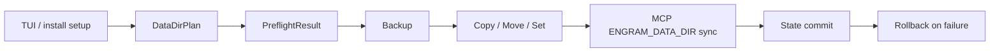

# ADR: Cloud-aware Engram Data-dir Migration Contract

Status: draft, waiting for maintainer approval  
Date: 2026-06-17  
Tracking branch: `adr/engram-data-dir-migration-contract`

This document preserves the proposal, decision record, issue draft, and PR-chain plan for the remaining Engram data-directory migration work. It is intentionally stored on a personal fork branch so the design survives machine changes while upstream approval is pending.


## Current State

| Item | Status |
|---|---|
| Gentle-AI issue #346 | Closed as completed after storage/disk-space infra landed |
| Gentle-AI PR #638 | Merged, adds cross-platform disk-space infra under `internal/storage` |
| Gentle-AI PR #700 | Closed unmerged because it linked closed #346 |
| Engram issue #202 | Open, asks for migration contract before approval |
| GitHub write access from Codex connector | Blocked with 403 for both Engram comments and Gentle-AI issue creation |

The next public action is still the same: post the Engram reply and open the Gentle-AI issue. The drafts are below so they can be posted manually if connector permissions are unavailable.

## Evidence

| Source | Design impact |
|---|---|
| `docs/codebase/memory-core.md` | Gentle-AI wires Engram into agents. Engram owns memory/runtime. |
| `docs/codebase/sync-and-cloud.md` | Gentle-AI sync is config sync. Engram cloud/autosync belongs to Engram runtime. |
| `internal/storage/*` | #638 provides disk-space checks, not the whole migration contract. |
| Engram `cmd/engram/main.go` | `ENGRAM_DATA_DIR` overrides the active data directory. |
| Engram `cmd/engram/cloud.go` | `cloud.json` is stored under the active data directory. |
| Engram `DOCS.md` | `ENGRAM_CLOUD_AUTOSYNC=1` enables autosync with cloud token/server config. |
| Engram diagnostics/store code | SQLite lock diagnostics exist in Engram, not Gentle-AI. |

## Decision

Define a conservative migration contract before continuing implementation. Gentle-AI should orchestrate setup/config changes, but should not absorb Engram runtime semantics.



## Ownership

| Area | Owner |
|---|---|
| Setup UX | Gentle-AI |
| Selected data directory | Gentle-AI state plus `ENGRAM_DATA_DIR` in MCP config |
| MCP config propagation | Gentle-AI |
| Backup orchestration | Gentle-AI |
| Filesystem migration orchestration | Gentle-AI |
| SQLite runtime semantics | Engram |
| `cloud.json` meaning | Engram |
| Autosync lifecycle | Engram |
| Cloud enrollment/repair/sync commands | Engram |
| Real lock/quiesce/migrate API, if added later | Engram |

## Migration Contract

### Destination Behavior

Reject by default:

- same directory
- destination inside current data directory
- non-empty destination
- insufficient disk space

No merge/import behavior is included in this contract.

### Backup Behavior

Create a snapshot before copy, move, delete, or start-fresh operations. The TUI review screen must show the backup location and scope.

Backup scopes:

- DB-only: `engram.db`, `engram.db-wal`, `engram.db-shm`
- DB plus cloud config: DB artifacts plus `cloud.json`, only after explicit user choice

### Locking / Stability Behavior

Do not claim a real runtime lock in Gentle-AI.

Current contract:

- tell the user to stop Engram and MCP clients before mutation
- run a before/after data-dir stability check around copy operations
- fail loudly if files change during copy

Future-compatible contract:

- if Engram exposes a lock/quiesce/migrate API later, call it through a small backend seam instead of moving runtime semantics into Gentle-AI

### Cloud Behavior

Detect cloud state before mutation:

- `<dataDir>/cloud.json`
- `ENGRAM_CLOUD_AUTOSYNC`
- `ENGRAM_CLOUD_TOKEN`
- `ENGRAM_CLOUD_SERVER`

If cloud state is detected, require an explicit user choice:

1. Preserve cloud config, copy `cloud.json` with DB artifacts.
2. Migrate local data only, leave cloud config behind and tell the user to re-enroll/reconfigure cloud later.
3. Cancel.

Gentle-AI must not run cloud operations such as `engram sync --cloud`, `engram cloud config`, enrollment, repair, or autosync management.

Gentle-AI must not modify cloud config content. It may only copy or omit `cloud.json` according to the explicit user choice.

### Rollback Behavior

If migration fails, roll back the affected parts together where possible:

- copied files
- removed/renamed source artifacts
- Gentle-AI state
- MCP config updates

If rollback itself fails, surface both the original error and rollback error.

## Proposed Go Shape

Keep the implementation small and idiomatic. Use concrete types from `internal/components/engram`, define tiny interfaces only at consumer/test seams, and avoid speculative top-level packages.

```text
internal/components/engram/
  env.go              DataDirEnvVar, DefaultDir, DBPath, CloudConfigPath
  datadir_plan.go     DataDirPlan, PreflightResult, CloudState, ArtifactPolicy
  datadir_ops.go      data-dir size/content helpers
  service.go          backup/copy/move/delete using ArtifactPolicy
  datadir_mcp.go      public SyncDataDirEnv facade
  datadir_mcp_json.go optional split if JSON adapter code grows
  datadir_mcp_toml.go optional split for Codex TOML

internal/tui/screens/
  engram_datadir.go   review/confirm/result rendering from PreflightResult

internal/app/
  app.go              orchestration, state commit, MCP rollback
```

Proposed helpers:

```go
const DataDirEnvVar = "ENGRAM_DATA_DIR"

func DefaultDir(homeDir string) string
func DBPath(dataDir string) string
func CloudConfigPath(dataDir string) string

type DataDirRef string
func (r DataDirRef) Resolve(homeDir string) string

type CloudState struct {
    HasCloudConfig bool
    AutosyncEnv    bool
    TokenEnv       bool
    ServerEnv      bool
}

func DetectCloudState(dataDir string, getenv func(string) string) CloudState

type ArtifactPolicy string

const (
    ArtifactPolicyDataOnly      ArtifactPolicy = "data-only"
    ArtifactPolicyPreserveCloud ArtifactPolicy = "preserve-cloud"
)
```

Important note: avoid promising future URI schemes in `DataDirRef` comments. Keep the persisted shape simple now. If Engram later supports remote stores or named profiles, adapt then.

## TUI / Setup Flow

The review screen before mutation should show:

- operation: keep, set, copy, move, start fresh
- current data directory
- destination data directory
- detected SQLite artifacts
- detected cloud state
- selected cloud handling
- backup scope and backup location
- destination validation result
- stop-Engram/stability requirement
- rollback scope

The result screen should show:

- success or failure
- active data directory after the operation
- backup snapshot ID/location when created
- next action if cloud config was not preserved

## PR Chain Plan

Do not open implementation PRs until the new issue has `status:approved`.

```text
Engram #202 design reply
  -> new Gentle-AI issue
  -> wait for status:approved
  -> clean replacement for #700
  -> continue slices
```

Planned implementation slices:

| PR | Boundary | Review budget goal |
|---|---|---:|
| 1 | Env/path/domain helpers only | <400 |
| 2 | Preflight: cloud detection, destination checks, artifact policy | <400 |
| 3 | Service: backup/copy/move/delete with policy | <400 |
| 4a | MCP env sync for JSON/YAML-style adapters | <400 |
| 4b | MCP env sync for Codex TOML, if needed | <400 |
| 5a | TUI render screens | <400 |
| 5b | TUI navigation/app command wiring | <400 |
| 6 | App state plus MCP rollback | <400 |
| 7+ | Hardening tests/docs split by behavior | <400 each |

Rules:

- one deliverable work unit per PR
- tests stay with the behavior they verify
- docs stay with user-visible behavior
- every PR includes chain context and a current-position diagram
- split before crossing the 400-line budget
- rebase each slice from upstream `main` before opening to avoid polluted diffs

## Draft Engram #202 Reply

```markdown
Agreed. I’m going to treat this as a design gate before continuing the Gentle-AI implementation slices.

The proposed boundary is: Gentle-AI owns setup/TUI UX, selected `ENGRAM_DATA_DIR`, MCP env propagation, backup orchestration, destination validation, and rollback of Gentle-AI-managed state/config. Engram owns SQLite runtime semantics, `cloud.json` meaning, cloud enrollment/autosync, and any future real lock/quiesce behavior.

The main gap I found is cloud state. Engram stores cloud config under the active data dir as `cloud.json`, and autosync can be enabled through env. So the migration flow must not silently drop or silently copy cloud state. Proposed rule: if `cloud.json` or cloud/autosync env is detected, the user must choose preserve cloud config, migrate local data only and re-enroll later, or cancel.

For locking, I will not claim Gentle-AI has a real runtime lock. The current safe contract is: stop Engram/MCP clients, run a before/after stability check, and fail if the data dir changes during copy. If Engram later exposes a lock/quiesce/migrate API, Gentle-AI should call that through a small backend seam instead of owning deeper store semantics.

I’ll open a focused Gentle-AI issue for this remaining migration contract before reopening/replacing the implementation slice.
```

## Draft Gentle-AI Issue

Title:

```text
feat(engram): add cloud-aware data-directory migration contract and setup flow
```

Body:

```markdown
### Pre-flight Checklist

- [x] I have searched existing issues and this is not a duplicate
- [x] I understand that PRs require an issue with `status:approved`

### Affected Area

TUI (terminal UI), Installation Pipeline, Documentation

### Problem Statement

#346 was completed by the initial Engram data-directory storage/disk-space infrastructure, but the remaining migration behavior still needs an approved contract before implementation continues.

The missing behavior is the safe setup/TUI contract for changing Engram's active data directory when existing data is present.

This matters because Engram's runtime now treats the data directory as more than only SQLite files:

- `ENGRAM_DATA_DIR` controls the active data directory.
- SQLite artifacts live there: `engram.db`, `engram.db-wal`, `engram.db-shm`.
- Engram cloud config is stored under the active data dir as `cloud.json`.
- Autosync can be enabled through `ENGRAM_CLOUD_AUTOSYNC=1` plus cloud token/server configuration.

A Gentle-AI migration flow must not silently drop cloud state, silently copy credential-bearing cloud config, or partially update MCP config/state if migration fails.

### Reproduction / Current Gap

1. Configure Engram with a data directory containing `engram.db`.
2. Configure Engram cloud so `<dataDir>/cloud.json` exists, or set cloud/autosync env such as `ENGRAM_CLOUD_AUTOSYNC`, `ENGRAM_CLOUD_TOKEN`, or `ENGRAM_CLOUD_SERVER`.
3. Attempt to choose or migrate to a new Engram data directory through Gentle-AI setup/TUI.
4. There is currently no approved Gentle-AI contract that defines backup scope, locking/stability, rollback, destination behavior, cloud-state handling, or the review screen before mutation.

### Proposed Solution

Add a conservative, cloud-aware Engram data-directory migration contract and setup/TUI flow.

Gentle-AI should own:

- setup/TUI UX for choosing the data directory
- `ENGRAM_DATA_DIR` propagation into existing Engram MCP configs
- destination validation
- backup orchestration
- filesystem operation orchestration
- rollback of Gentle-AI-managed state and MCP config

Engram should continue to own:

- SQLite runtime semantics
- `cloud.json` meaning
- cloud enrollment
- autosync behavior
- any future real lock/quiesce/migrate API

### Acceptance Criteria

- [ ] Preflight detects DB artifacts, `cloud.json`, and cloud/autosync env.
- [ ] User must choose preserve cloud config, local-data-only, or cancel when cloud state is detected.
- [ ] Destination validation rejects same, nested, non-empty, and insufficient-space destinations.
- [ ] Copy/move/delete/start-fresh snapshot before mutation.
- [ ] Copy/move checks source stability and fails if Engram data changes during copy.
- [ ] MCP config updates preserve existing Engram command paths and unrelated env keys.
- [ ] `ENGRAM_DATA_DIR` is added/removed only in existing Engram MCP configs.
- [ ] State write and MCP config update failures roll back together where possible.
- [ ] TUI review screen displays source, destination, backup scope, cloud status, selected cloud handling, and stop-Engram requirement.
- [ ] Docs keep the boundary clear: Gentle-AI configures setup; Engram owns runtime/cloud semantics.

### Out of Scope

- Implementing Engram cloud sync inside Gentle-AI
- Changing the MCP protocol
- Running `engram sync --cloud` or cloud enrollment from Gentle-AI
- Merging into non-empty destination directories
- Claiming a real lock before Engram exposes one
```

## Blockers

- Codex GitHub connector returned 403 when attempting to comment on `Gentleman-Programming/engram#202`.
- Codex GitHub connector returned 403 when attempting to create the Gentle-AI issue.
- `gh` CLI is not installed in this environment.

Manual fallback:

1. Post the Engram reply above on Engram #202.
2. Create the Gentle-AI feature issue with the draft above.
3. Wait for `status:approved`.
4. Only then start/reopen implementation PRs.
